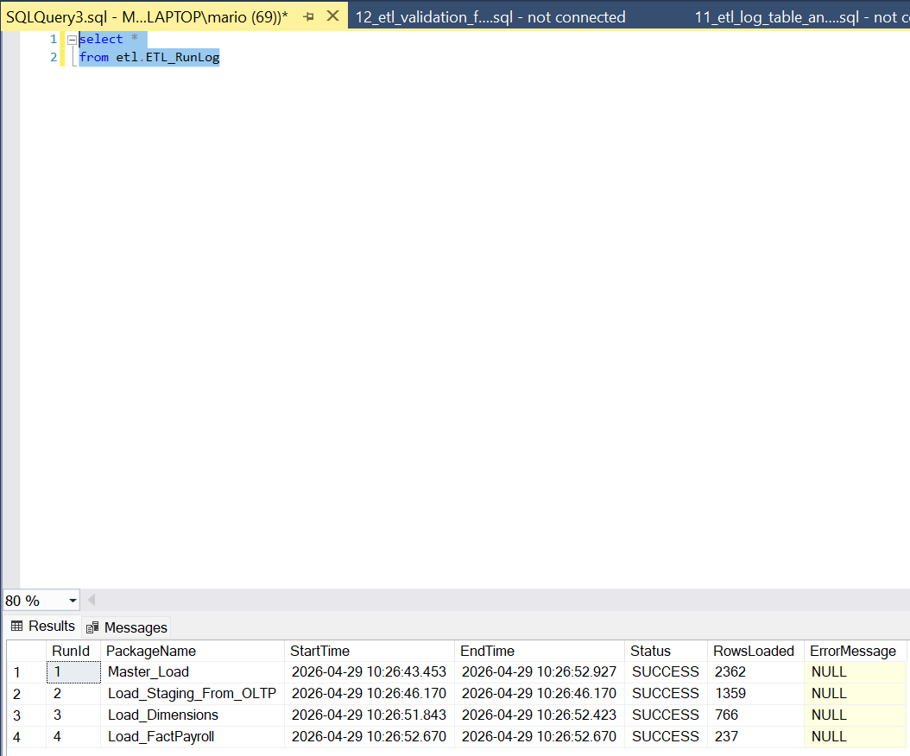

# Workforce Payroll Data Warehouse

## 📊 Overview
Built an end-to-end data pipeline using SQL Server, SSIS, and SSRS to transform HR and payroll data into a star schema data warehouse. The project includes ETL logging, validation checks, failure handling, and reporting dashboards for payroll analysis.

## 🛠️ Tools Used
- SQL Server
- SSIS
- SSRS

## 🧱 Architecture
OLTP Database → Staging Layer → Data Warehouse → SSRS Reports

## 📦 Key Features
- Star schema with FactPayroll and dimension tables
- SSIS ETL pipeline across staging, dimensions, and fact layers
- ETL run logging with success and failure tracking
- Validation checks for row counts, totals, and missing keys
- SSRS dashboard with payroll, overtime, and trend analysis

## 📷 Screenshots

### ETL Pipeline ➡️⚙️➡️ 

### Data Warehouse 🏭

### ETL Run Log 📋

### SSRS Report 📑

## 📈 Outcome
Delivered a complete data warehouse and reporting solution for analyzing payroll cost, overtime usage, and workforce trends.
